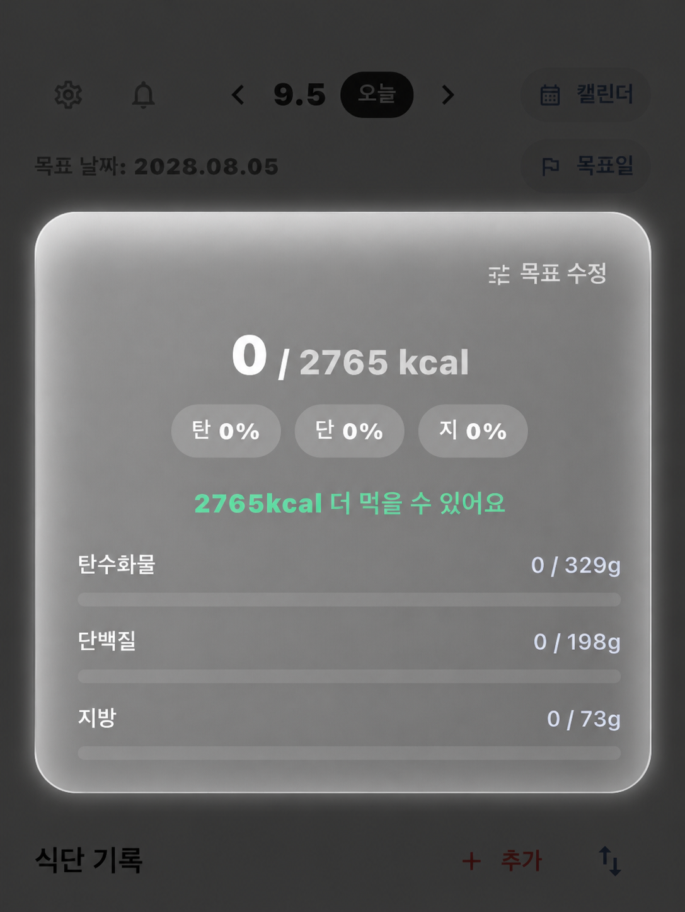
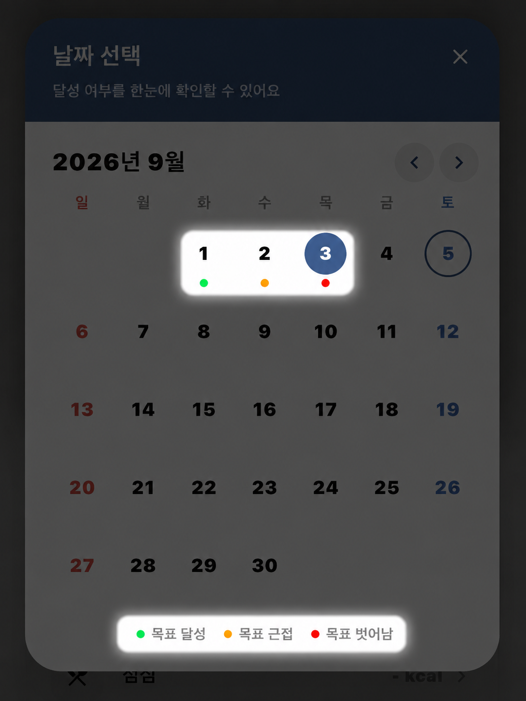
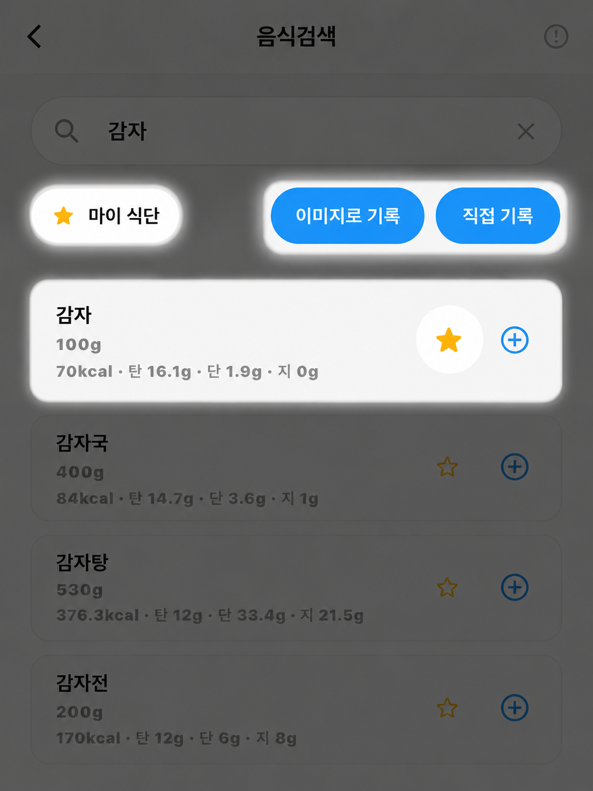
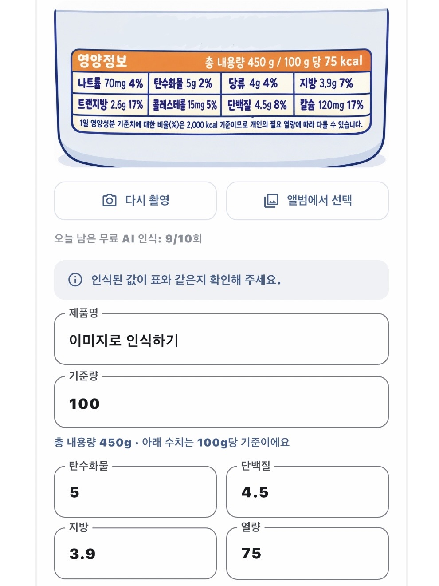

# 칼캘 (CalCal) — 칼로리 캘린더

**오늘 뭘 먹었는지, 목표까지 얼마나 남았는지 캘린더 한 장으로.**

칼캘은 하루 섭취 칼로리와 탄수화물·단백질·지방 양을 캘린더로 기록하고, 목표 대비 진행 상황을 한눈에 확인하는 식단 기록 앱입니다.

<table>
  <tr>
    <td align="center"></td>
    <td align="center"></td>
    <td align="center"></td>
    <td align="center"></td>
  </tr>
  <tr>
    <td align="center">오늘의 칼로리와 영양 균형</td>
    <td align="center">날짜별 목표 달성 현황</td>
    <td align="center">검색하고 빠르게 기록</td>
    <td align="center">영양성분표를 찍어서 기록</td>
  </tr>
</table>

---

## 이런 분께 추천해요

- 다이어트 중인데 하루에 얼마나 먹어야 할지 감이 안 오는 분
- 근육을 키우려고 단백질 섭취량을 챙기고 싶은 분
- 식단 앱을 써봤지만 입력이 번거로워서 금방 그만둔 분

## 주요 기능

### 📅 캘린더로 보는 내 식단
날짜마다 목표를 **달성했는지, 근접했는지, 벗어났는지** 색으로 표시돼요. 한 달 흐름이 한눈에 보입니다.

### 🎯 나에게 맞는 목표 자동 계산
처음 시작할 때 나이, 현재 체중, 목표 체중, 평소 활동량, 목표(감량 · 유지 · 근육 증가)를 알려주세요. 하루 칼로리와 탄수화물·단백질·지방 목표를 자동으로 계산해 드려요. 목표 날짜를 바꾸면 그에 맞게 칼로리도 다시 조정됩니다.

### 🔍 음식 검색으로 간편 기록
식품의약품안전처 식품영양성분 데이터베이스에서 음식을 검색해 바로 기록할 수 있어요. 섭취량만 입력하면 영양성분이 자동으로 계산됩니다.

### 📸 영양성분표 사진으로 입력
가공식품 뒷면의 영양성분표를 찍거나 앨범에서 고르면, AI가 열량과 탄·단·지 수치를 읽어 자동으로 채워줘요. 하루 **10회까지 무료**로 이용할 수 있어요.

### ⭐ 마이 식단
자주 먹는 음식에 별을 눌러 저장해 두세요. 다음부터는 검색 없이 바로 추가할 수 있어요.

### 🔔 기록을 잊지 않게 알림
- **하루 기록 리마인더**: 매일 저녁 8시까지 기록이 없으면 알려드려요.
- **나만의 습관 알림**: 영양제 먹기, 운동하기 등 원하는 이름·요일·시간으로 직접 만들 수 있어요.

## 시작하기

1. 앱을 설치하고 이용약관과 개인정보처리방침에 동의해요.
2. **로그인 없이 바로 시작**할 수 있어요. Google · Apple · 카카오 계정으로 로그인하면 기록이 백업되고 여러 기기에서 이어서 쓸 수 있어요.
3. 기초 정보와 목표를 입력하면 준비 끝! 첫 실행 때 나오는 짧은 사용법 안내를 참고하세요.

> 로그인 없이 쓰다가 나중에 설정에서 로그인하면, 그동안의 기록을 계정에 그대로 이어서 저장할 수 있어요.
> 단, 이미 칼캘에 가입한 적이 있는 계정으로 로그인하면 기존 계정으로 전환되고, 로그인 전 기록은 옮겨지지 않아요.

## 자주 묻는 질문

**Q. 무료인가요?**
네, 모든 기능을 무료로 이용할 수 있어요. 영양성분표 AI 인식만 하루 10회로 제한돼요.

**Q. 검색 결과가 이상해요.**
음식 검색 화면의 **"검색 결과가 이상하신가요?"**에서 바로 알려주세요. 영양성분 오류, 브랜드 정보 오류 등을 확인해 반영할게요.

**Q. 탈퇴하면 기록은 어떻게 되나요?**
설정 → 회원 탈퇴를 하면 계정과 모든 식단 기록이 삭제되며 복구할 수 없어요.

**Q. 알림이 안 와요.**
기기 설정에서 칼캘의 알림 권한이 켜져 있는지 확인해 주세요.

## 문의

앱 내 **설정 → 고객지원**에서 문의하거나 오류를 신고할 수 있어요.

- 이메일: kyomdev@gmail.com

## 약관 및 정책

- [개인정보처리방침](docs/privacy_policy.md)
- [이용약관](docs/terms_of_service.md)

---

개발 환경 설정과 프로젝트 구조는 [개발 가이드](docs/DEVELOPMENT.md)를 참고하세요.
